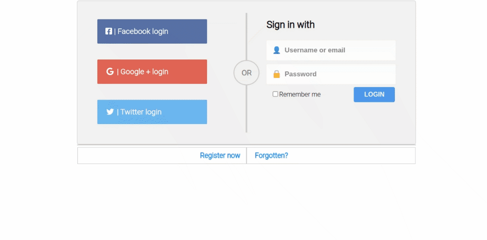

# Sass Login Page

simple Login Page Project with HTML5-Sass Structure.

**[Test this app yourself](https://bhasim.github.io/log-in-page/)**

---

---

### About Project

A simple Login page to apply the idea of sass structure in Login Page Project with social media links.

##### Developed With

- [x] _HTML5_
- [x] _CSS3_
- [x] _SASS_
- [x] _SCSS_
- [ ] _JavaScript_
- [ ] _React_
- [ ] _Bootstrap_
- [x] _npm_
- [ ] _..._

---

### Contact

Mail: <Baha.hasim@dci.student> 
GitHub: [Bhasim](https://github.com/) 
LinkedIn: [Bahaaldean Hashim](https://www.linkedin.com/in/bahaaldean-hashim-598463103)

---

Made with ❤️ and ☕ by me.
